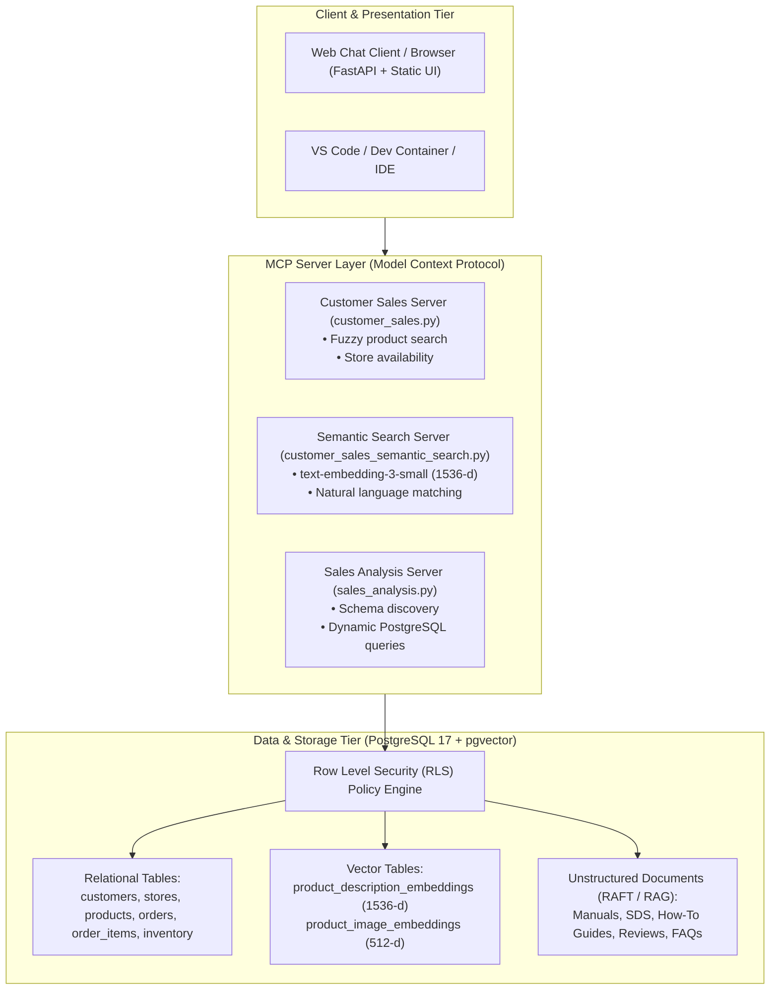
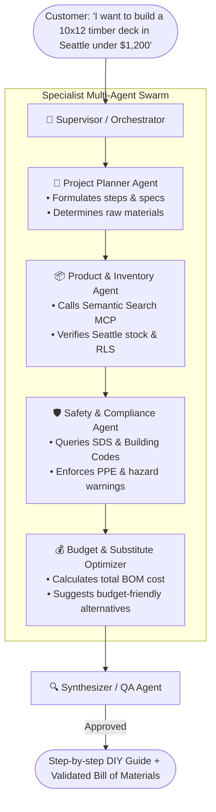

# Comprehensive Guide: Building Multi-Agent Systems (MAS) on Zava DIY
> **Course**: Postgraduate Certificate in Artificial Intelligence (PG Cert AI)  
> **Repository**: `microsoft/ai-tour-26-zava-diy-dataset-plus-mcp`  
> **Topic**: Autonomous AI Agents, Model Context Protocol (MCP), Multi-Agent Orchestration, and System Design

---

## 📑 Table of Contents
1. [Executive Summary & Project Context](#1-executive-summary--project-context)
2. [What is Already Built vs. What You Must Build](#2-what-is-already-built-vs-what-you-must-build)
3. [සරල සිංහල පැහැදිලි කිරීම (Summary in Sinhala)](#3-සරල-සිංහල-පැහැදිලි-කිරීම-summary-in-sinhala)
4. [Module 1: The Universal Anatomy of an AI Agent](#4-module-1-the-universal-anatomy-of-an-ai-agent)
5. [Module 2: Tool Grounding via Model Context Protocol (MCP)](#5-module-2-tool-grounding-via-model-context-protocol-mcp)
6. [Module 3: Multi-Agent Architecture & Orchestration (LangGraph)](#6-module-3-multi-agent-architecture--orchestration-langgraph)
7. [Module 4: Building the Streaming Agent Backend (`port 8006`)](#7-module-4-building-the-streaming-agent-backend-port-8006)
8. [Module 5: Transferable 6-Step Blueprint for Any Future Agent Project](#8-module-5-transferable-6-step-blueprint-for-any-future-agent-project)
9. [Module 6: Academic Evaluation & Benchmarking Strategy](#9-module-6-academic-evaluation--benchmarking-strategy)

---

## 1. Executive Summary & Project Context

### The Domain
**Zava DIY** is a fictional home improvement retailer in Washington State with 8 store locations (7 physical stores in Seattle, Bellevue, Tacoma, Spokane, Everett, Redmond, Kirkland + 1 Online Store).

### The Existing Data & Infrastructure
* **Database**: PostgreSQL 17 + `pgvector` extension.
* **Scale**: 50,000+ customers, 400+ products across 9 DIY categories, 200,000+ historical orders, and store-specific stock levels.
* **Security**: Row-Level Security (RLS) enforcing tenant isolation between store managers and customer views.
* **Multimodal Search**: 1536-dimensional text embeddings (`text-embedding-3-small`) and 512-dimensional image embeddings (CLIP).
* **Unstructured Knowledge Base**: Safety Data Sheets (OSHA/SDS), installation manuals, and DIY project guides (`data/raft-generator/`).



---

## 2. What is Already Built vs. What You Must Build

| Component | Status in this Repo | What is included |
| :--- | :--- | :--- |
| **1. Database & Datasets** | ✅ Complete | PostgreSQL schemas, 50k customers, products, transactions, pgvector embeddings, and RLS security. |
| **2. MCP Tool Servers** | ✅ Complete | 3 FastMCP servers ready to be called (`customer_sales.py`, `customer_sales_semantic_search.py`, `sales_analysis.py`). |
| **3. Frontend Chat UI** | ✅ Complete | HTML/JS chat box with file upload and streaming UI (`src/shared/static/`). |
| **4. Web Proxy Server** | ✅ Complete | `src/python/web_app/web_app.py` runs on port `8005` to serve the website. |
| **5. Multi-Agent Service** | ❌ **To Build (Your Core Task)** | The **Agent Backend (`port 8006`)** connecting LLMs to the MCP tools and orchestrating the agents. |

---

## 3. සරල සිංහල පැහැදිලි කිරීම (Summary in Sinhala)

* **මේ Project එක මොකක්ද?**: Zava DIY කියන්නේ ගෙවල් හැදීමට සහ අලුත්වැඩියාවට අවශ්‍ය බඩු (Hardware) විකුණන ආයතනයක්. මේ repository එකේ ඒ ආයතනයේ සම්පූර්ණ Database එක, AI සෙවුම් පද්ධති (Embeddings), සහ Tools (MCP) සකස් කර දී ඇත.
* **දැනට LLM එකකට සම්බන්ධ කර ඇත්ද?**: නැත. දැනට Web Interface (Chat UI) එකක් තිබුණද, ඊට පිටුපසින් වැඩ කරන **AI Agent Brain එක (Port 8006)** සකස් කර නොමැත.
* **ඔබේ කාර්යභාරය (Assignment Task)**: පාරිභෝගිකයාගේ අවශ්‍යතා හඳුනාගෙන, Zava Database එකෙන් බඩු සොයා, ආරක්ෂක උපදෙස් පරීක්ෂා කර සම්පූර්ණ සැලසුමක් ලබාදෙන **Multi-Agent System (MAS)** එකක් Python වලින් ගොඩනැගීමයි.

---

## 4. Module 1: The Universal Anatomy of an AI Agent

### The Mental Model
An LLM is a text engine. An **Agent** is an LLM running inside a loop with access to:
1. **Perception**: User prompt + System instructions + Session history.
2. **Tools (Actuators)**: Functions that interact with databases, APIs, or calculators.
3. **The Decision Loop (ReAct)**: **Re**ason $\rightarrow$ **Act** (Call Tool) $\rightarrow$ **Observe** (Parse Result) $\rightarrow$ Iterate until the goal is achieved.

### Code: Zero-Dependency Python ReAct Agent Loop
```python
"""
minimal_agent_loop.py
Demonstrates the fundamental ReAct loop using OpenAI / Azure OpenAI function calling.
"""
import json
from openai import OpenAI

client = OpenAI(api_key="YOUR_API_KEY")

# 1. Define a tool function
def query_product_catalog(product_name: str) -> str:
    """Searches the Zava DIY product catalog."""
    mock_db = {
        "drill": "Cordless Drill 18V Li-Ion - $89.99 (In Stock: Seattle, Bellevue)",
        "saw": "Circular Saw 7-1/4 inch - $119.99 (In Stock: Seattle)",
        "screws": "Deck Screws 2-1/2 inch (5lb box) - $24.99 (In Stock: All stores)"
    }
    for key, val in mock_db.items():
        if key in product_name.lower():
            return val
    return f"No products found matching '{product_name}'."

# 2. Tool schema
tools = [
    {
        "type": "function",
        "function": {
            "name": "query_product_catalog",
            "description": "Look up tools and materials in the Zava DIY catalog",
            "parameters": {
                "type": "object",
                "properties": {
                    "product_name": {
                        "type": "string",
                        "description": "Name of tool or material"
                    }
                },
                "required": ["product_name"]
            }
        }
    }
]

available_functions = {"query_product_catalog": query_product_catalog}

def run_agent(user_query: str):
    messages = [
        {"role": "system", "content": "You are a helpful Zava DIY assistant. Always verify product stock using tools."},
        {"role": "user", "content": user_query}
    ]

    print(f"\n[User Query]: {user_query}")

    for step in range(5):  # Max iterations to prevent infinite loops
        response = client.chat.completions.create(
            model="gpt-4o-mini",
            messages=messages,
            tools=tools,
            tool_choice="auto"
        )
        msg = response.choices[0].message
        messages.append(msg)

        if msg.tool_calls:
            for tool_call in msg.tool_calls:
                func_name = tool_call.function.name
                func_args = json.loads(tool_call.function.arguments)
                print(f"🛠️ [Action]: Calling `{func_name}` with {func_args}")
                
                output = available_functions[func_name](**func_args)
                print(f"👁️ [Observation]: {output}")

                messages.append({
                    "role": "tool",
                    "tool_call_id": tool_call.id,
                    "content": str(output)
                })
        else:
            print(f"\n✅ [Final Response]:\n{msg.content}")
            return msg.content
```

---

## 5. Module 2: Tool Grounding via Model Context Protocol (MCP)

**MCP (Model Context Protocol)** standardizes how AI agents discover and execute tools on remote servers or local subprocesses via `stdio`.

### Code: Python MCP Client for Zava Servers
```python
"""
mcp_client_helper.py
Connects an AI Agent to local MCP servers in this repository.
"""
import asyncio
import os
from contextlib import AsyncExitStack
from mcp import ClientSession, StdioServerParameters
from mcp.client.stdio import stdio_client

class ZavaMCPClient:
    def __init__(self):
        self.session: ClientSession | None = None
        self.exit_stack = AsyncExitStack()

    async def connect(self, script_path: str, rls_user_id: str = "00000000-0000-0000-0000-000000000000"):
        """Connects to an MCP Server via stdio."""
        server_params = StdioServerParameters(
            command="python",
            args=[script_path, "--stdio", f"--RLS_USER_ID={rls_user_id}"],
            env=os.environ.copy()
        )
        transport = await self.exit_stack.enter_async_context(stdio_client(server_params))
        read_stream, write_stream = transport
        
        self.session = await self.exit_stack.enter_async_context(ClientSession(read_stream, write_stream))
        await self.session.initialize()
        
        tools = await self.session.list_tools()
        print(f"✅ Connected to MCP. Available tools: {[t.name for t in tools.tools]}")
        return tools

    async def call_tool(self, tool_name: str, arguments: dict):
        if not self.session:
            raise RuntimeError("MCP Client is not connected.")
        result = await self.session.call_tool(tool_name, arguments=arguments)
        return result.content

    async def close(self):
        await self.exit_stack.aclose()
```

---

## 6. Module 3: Multi-Agent Architecture & Orchestration (LangGraph)

### Architecture Workflow


### Code: Production Multi-Agent Graph (LangGraph)
```python
"""
multi_agent_system.py
Complete Multi-Agent System for Zava DIY using LangGraph and Typed State.
"""
from typing import Annotated, List, Dict, Any
from pydantic import BaseModel, Field
from langgraph.graph import StateGraph, START, END
from langchain_openai import ChatOpenAI
from langchain_core.messages import SystemMessage, HumanMessage

# 1. Typed Shared State
class AgentState(BaseModel):
    user_query: str
    store_location: str = "Seattle"
    project_steps: List[str] = Field(default_factory=list)
    required_materials: List[str] = Field(default_factory=list)
    matched_products: List[Dict[str, Any]] = Field(default_factory=list)
    safety_warnings: List[str] = Field(default_factory=list)
    total_cost: float = 0.0
    is_approved: bool = False
    final_output: str = ""

llm = ChatOpenAI(model="gpt-4o-mini", temperature=0.2)

# 2. Agent Nodes
def project_planner_node(state: AgentState) -> Dict[str, Any]:
    prompt = f"""
    You are a Master Carpenter for Zava DIY.
    User Query: {state.user_query}
    Break this project into 3-5 steps and list raw materials.
    Format:
    STEPS:
    - Step 1
    MATERIALS:
    - Material 1
    """
    response = llm.invoke([SystemMessage(content=prompt)])
    steps, materials, current = [], [], None
    for line in response.content.split("\n"):
        line = line.strip()
        if "STEPS:" in line: current = "steps"
        elif "MATERIALS:" in line: current = "materials"
        elif line.startswith("- ") and current == "steps": steps.append(line[2:])
        elif line.startswith("- ") and current == "materials": materials.append(line[2:])
    return {"project_steps": steps, "required_materials": materials}

def inventory_agent_node(state: AgentState) -> Dict[str, Any]:
    matched = []
    total = 0.0
    for mat in state.required_materials:
        price = 24.50
        matched.append({
            "name": f"Zava Pro {mat.title()}",
            "sku": f"ZAVA-{abs(hash(mat)) % 10000:04d}",
            "unit_price": price,
            "availability": f"In Stock ({state.store_location})"
        })
        total += price
    return {"matched_products": matched, "total_cost": round(total, 2)}

def safety_inspector_node(state: AgentState) -> Dict[str, Any]:
    prompt = f"""
    You are a Certified Safety Inspector.
    Review steps: {state.project_steps} and materials: {[p['name'] for p in state.matched_products]}.
    List at least 2 mandatory PPE or safety warnings. Prefix with '- '.
    """
    response = llm.invoke([SystemMessage(content=prompt)])
    warnings = [l[2:] for l in response.content.split("\n") if l.strip().startswith("- ")]
    return {"safety_warnings": warnings, "is_approved": True}

def synthesizer_node(state: AgentState) -> Dict[str, Any]:
    report = f"""# 🛠️ Zava DIY Custom Project Plan\n**Store**: {state.store_location} | **Estimated Cost**: ${state.total_cost:.2f}\n\n### 📋 Execution Steps\n"""
    for i, step in enumerate(state.project_steps, 1): report += f"{i}. {step}\n"
    report += "\n### 🛒 Bill of Materials\n"
    for item in state.matched_products: report += f"- **{item['name']}** (`{item['sku']}`) - ${item['unit_price']:.2f}\n"
    report += "\n### ⚠️ Safety & PPE Directives\n"
    for w in state.safety_warnings: report += f"- 🛡️ {w}\n"
    return {"final_output": report}

# 3. Construct Graph
workflow = StateGraph(AgentState)
workflow.add_node("planner", project_planner_node)
workflow.add_node("inventory", inventory_agent_node)
workflow.add_node("safety", safety_inspector_node)
workflow.add_node("synthesizer", synthesizer_node)

workflow.add_edge(START, "planner")
workflow.add_edge("planner", "inventory")
workflow.add_edge("inventory", "safety")
workflow.add_edge("safety", "synthesizer")
workflow.add_edge("synthesizer", END)

app = workflow.compile()
```

---

## 7. Module 4: Building the Streaming Agent Backend (`port 8006`)

`web_app.py` on port `8005` expects a backend service on `http://127.0.0.1:8006/chat/stream`.

### Code: FastAPI Agent Service
```python
"""
agent_service.py
Backend Agent Service running on port 8006.
"""
import asyncio
import json
from fastapi import FastAPI
from fastapi.responses import StreamingResponse
from pydantic import BaseModel
import uvicorn

app = FastAPI(title="Zava Multi-Agent Service")

class ChatRequest(BaseModel):
    message: str
    session_id: str = "default"

async def stream_agent_execution(user_message: str):
    # Stream intermediate multi-agent thoughts
    yield f"data: {json.dumps({'content': '🧠 **Project Planner Agent**: Deconstructing DIY requirements...\\n\\n'})}\n\n"
    await asyncio.sleep(0.4)

    yield f"data: {json.dumps({'content': '📦 **Inventory Agent**: Querying Zava MCP Catalog & Seattle stock...\\n\\n'})}\n\n"
    await asyncio.sleep(0.4)

    yield f"data: {json.dumps({'content': '🛡️ **Safety Agent**: Auditing OSHA guidelines and PPE standards...\\n\\n---\\n\\n'})}\n\n"
    await asyncio.sleep(0.4)

    final_text = f"### Plan for: {user_message}\n\n1. Measure joists.\n2. Fasten brackets using 1/2-inch Lag Bolts.\n3. Verify load safety."
    for word in final_text.split(" "):
        yield f"data: {json.dumps({'content': word + ' '})}\n\n"
        await asyncio.sleep(0.03)

    yield f"data: {json.dumps({'done': True})}\n\n"

@app.post("/chat/stream")
async def chat_stream(req: ChatRequest):
    return StreamingResponse(
        stream_agent_execution(req.message),
        media_type="text/event-stream",
        headers={"Cache-Control": "no-cache", "Connection": "keep-alive"}
    )

if __name__ == "__main__":
    uvicorn.run(app, host="127.0.0.1", port=8006)
```

---

## 8. Module 5: Transferable 6-Step Blueprint for Any Future Agent Project

```
Step 1: Define Typed State (Pydantic / Dataclass)
   ↓
Step 2: Atomize Tools & MCP Connectors (Read/Write functions with strict schemas)
   ↓
Step 3: Assign Distinct Agent Personas (Specialization > Generalization)
   ↓
Step 4: Design Graph Topology (Linear, Routing, or Critique Loops)
   ↓
Step 5: Enforce Guardrails & Human-in-the-Loop (Approval gates before destructive actions)
   ↓
Step 6: Systematic Evaluation (LLM-as-a-Judge test suites)
```

1. **Typed State First**: Never pass raw unconstrained dictionaries between agents.
2. **Atomic Tools**: Build single-purpose functions with explicit docstrings and return types.
3. **Functional Specialization**: Spin up a new agent when instructions, tools, or permissions diverge.
4. **Critique Loops**: Place an Auditor/Evaluator node before critical outputs.
5. **Guardrails**: Implement schema validation and deterministic code assertions.
6. **Quantitative Benchmarks**: Always evaluate accuracy and safety systematically.

---

## 9. Module 6: Academic Evaluation & Benchmarking Strategy

For your PG Cert AI report:
1. **Benchmark Set**: Construct 20 representative test queries across categories (e.g. Decking, Electrical, Plumbing, Gardening).
2. **Comparison Matrix**: Run all queries through:
   * *Baseline*: Single Monolithic Prompt.
   * *Proposed*: Multi-Agent System (Planner + Inventory + Safety + Synthesizer).
3. **Quantitative Metrics (LLM-as-a-Judge)**:
   * **Completeness (1-5)**: Are all necessary materials included?
   * **Catalog Grounding (1-5)**: Are SKUs real and in-stock?
   * **Safety Compliance (1-5)**: Were PPE and hazard warnings properly identified?
   * **Latency & Token Cost**: Measure response time and total token usage.
